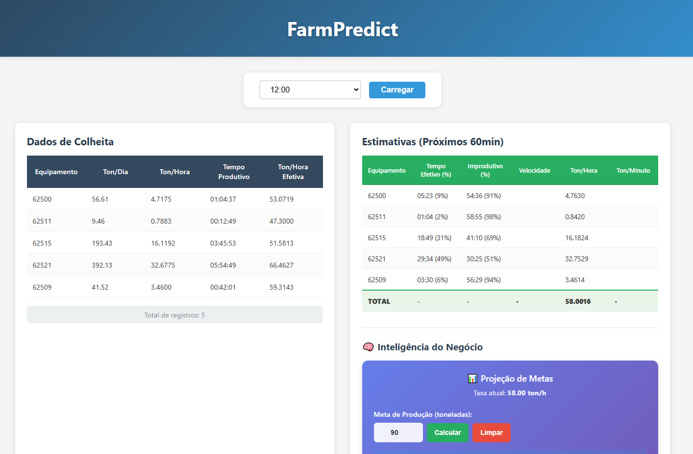
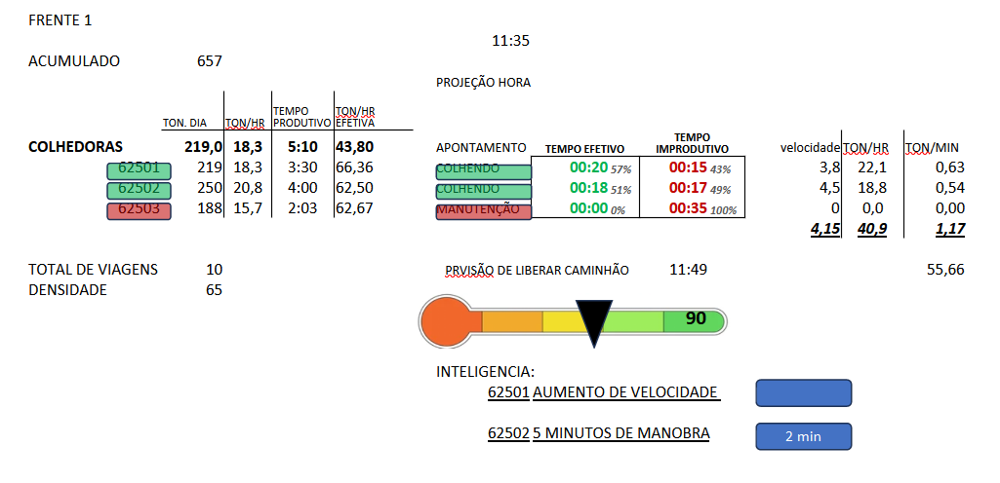

# FarmPredict

Aplicação web inteligente para análise, estimativa e predição de dados de colheita de cana-de-açúcar com funcionalidades avançadas de business intelligence.


## Preview

## Modelo



## Tecnologias Utilizadas

- **Frontend**: React.js com hooks e componentes funcionais
- **Backend**: Node.js com Express
- **Fonte de Dados**: CSV via GitHub (preparado para migração futura para API REST)
- **Styling**: CSS3 moderno com gradientes e animações

## Funcionalidades Principais

### 📊 Visualização de Dados em Tempo Real
- Carregamento dinâmico de dados de colheita por horário
- Tabela interativa com dados de produtividade das colhedoras
- Interface responsiva com design profissional

### 🔮 Sistema de Estimativas Inteligentes
- Projeções automatizadas para os próximos 60 minutos
- Cálculo de tempo produtivo e improdutivo baseado em dados históricos
- Estimativas de produção por equipamento com base na eficiência atual

### 🧠 Inteligência do Negócio
- **Calculadora de Metas**: Define metas de produção e calcula tempo necessário
- **Projeções Temporais**: Hora atual vs. hora prevista para atingir objetivos
- **Insights Alternativos**: Sugestões para otimização e aumento de produtividade
- **Interface Intuitiva**: Input otimizado com suporte a tecla Enter

### ⚙️ Cálculos Automáticos e Inteligentes
- **Toneladas por hora**: toneladas por dia ÷ horário atual
- **Toneladas por hora efetiva**: toneladas por dia ÷ tempo produtivo
- **Projeções de eficiência**: Baseadas em porcentagem de tempo produtivo
- **Análise de gaps**: Identificação de diferenças entre meta e produção atual

## Estrutura de Dados

### Dados de Entrada (CSV)
- **Descrição do Grupo de Equipamento** (frente/equipe)
- **Código Equipamento** (ID da colhedora)
- **Data e Hora** dos registros
- **Descrição do Grupo da Operação** (status operacional)
- **Toneladas por dia (acumulada)**
- **Tempo produtivo (acumulado)** no formato hh:mm:ss

### Dados Calculados Automaticamente
- **Toneladas por hora**: Taxa de produção baseada no horário atual
- **Toneladas por hora efetiva**: Taxa baseada apenas no tempo produtivo
- **Projeções de 60 minutos**: Estimativas de produção futura
- **Tempo para metas**: Cálculo de tempo necessário para atingir objetivos
- **Otimizações sugeridas**: Insights para melhoria de performance

## Interface da Aplicação

### 🎯 Layout Principal
A interface é dividida em duas colunas principais com design moderno e funcional:

#### Coluna Esquerda - Dados de Colheita
- **Tabela de Produtividade**: Exibe dados em tempo real das colhedoras
- **Colunas**: Equipamento, Ton/Dia, Ton/Hora, Tempo Produtivo, Ton/Hora Efetiva
- **Atualização sincronizada** com seleção de horário

#### Coluna Direita - Análises Avançadas

**📈 Tabela de Estimativas (Próximos 60min)**
- Equipamento e código de referência
- Tempo Efetivo (%) com projeção mm:ss
- Tempo Improdutivo (%) complementar
- Ton/Hora projetada baseada na eficiência
- Linha de totais com somatórias automáticas

**🧠 Inteligência do Negócio**
- **Widget de Projeção de Metas** com visual moderno
- **Input otimizado** para metas de 1-3 dígitos (suporte a Enter)
- **Blocos informativos organizados**:
  - Tempo adicional e total necessário
  - Hora atual e prevista para atingir meta
  - Produção atual e quantidade faltante
- **Insights automáticos** para otimização em 60 minutos

### 🎨 Design e UX
- **Cores diferenciadas**: Azul para dados originais, Verde para estimativas
- **Gradiente moderno**: Background azul-roxo no widget de BI
- **Responsividade total**: Adapta-se a diferentes tamanhos de tela
- **Alinhamento perfeito**: Tabelas sincronizadas linha por linha
- **Animações suaves**: Transições e efeitos visuais profissionais

### Pré-requisitos
- Node.js (versão 14 ou superior)
- npm ou yarn

### 🚀 Opção 1: Execução Simplificada (Recomendado)
```bash
# 1. Clone/baixe o projeto e entre na pasta
cd farmpredict

# 2. Instale todas as dependências de uma vez
npm run install-all

# 3. Execute frontend e backend juntos
npm run dev
```
✅ **Um comando só roda tudo!** Frontend (porta 3000) + Backend (porta 5000)

### 🔧 Opção 2: Scripts Separados
```bash
# Terminal 1 - Backend
npm run server

# Terminal 2 - Frontend
npm run client
```

### 📋 Opção 3: Execução Manual
```bash
# Terminal 1 - Backend
cd backend
npm install
npm start

# Terminal 2 - Frontend
cd frontend
npm install
npm start
```

### Scripts Disponíveis
- `npm run dev` - Executa frontend e backend simultaneamente
- `npm run server` - Executa apenas o backend
- `npm run client` - Executa apenas o frontend
- `npm run install-all` - Instala dependências de todos os projetos
- `npm run build` - Gera build de produção do frontend

## Estrutura do Projeto

```
farmpredict/
├── package.json          # Scripts principais e dependências compartilhadas
├── README.md
├── .gitignore
├── farmpredict.py        # Script Python para geração de dados CSV realistas
├── frontend/
│   ├── src/
│   │   ├── App.js        # Componente principal com todas as funcionalidades
│   │   ├── App.css       # Estilos modernos com gradientes e animações
│   │   ├── index.js      # Ponto de entrada React
│   │   └── index.css     # Estilos base
│   ├── public/
│   │   └── index.html    # Template HTML otimizado
│   └── package.json      # Dependências do frontend
├── backend/
│   ├── server.js         # API Express com endpoints otimizados
│   └── package.json      # Dependências do backend
└── data/                 # Arquivos CSV gerados (no GitHub)
    ├── painel-01h00.csv
    ├── painel-02h00.csv
    ├── ...
    └── painel-23h00.csv
```

## Arquitetura e Componentes

### Backend (Node.js + Express)
- **Endpoint principal**: `/api/data/:hour` para carregamento de dados CSV
- **Processamento inteligente**: Mapeamento automático de colunas CSV
- **Cálculos server-side**: Métricas de produtividade em tempo real
- **Tratamento de erros**: Validação e resposta estruturada
- **CORS configurado**: Comunicação segura frontend-backend

### Frontend (React)
- **Componentes modulares**: TimeSelector, DataTable, EstimateTable, BusinessIntelligence
- **Estado sincronizado**: Controle preciso de quando atualizar dados
- **Hooks customizados**: useState para gerenciamento de estado
- **Cálculos client-side**: Estimativas e projeções em tempo real
- **Interface responsiva**: Design adaptável para desktop e mobile

### Geração de Dados (Python)
- **Script farmpredict.py**: Gera dados CSV realistas e consistentes
- **Algoritmos de produtividade**: Simulação de fadiga e variação por equipamento
- **Dados temporais**: Processamento de intervalos de horário produtivo
- **Ordenação automática**: Equipamentos ordenados numericamente
- **Validação de consistência**: Evita dados discrepantes entre horários

## URL dos Dados

Os dados são carregados dinamicamente a partir do GitHub:
```
https://raw.githubusercontent.com/andreluizfrancabatista/farmpredict/refs/heads/main/data/painel-{hora}.csv
```

**Formato dos arquivos:** `painel-01h00.csv`, `painel-11h00.csv`, `painel-23h00.csv`, etc.

### Estrutura Esperada do CSV
```csv
Descrição do Grupo de Equipamento,Código Equipamento,Data,Hora,Descrição do Grupo da Operação,Toneladas por dia (acumulada),Toneladas por hora,Tempo produtivo (acumulado),Toneladas por hora efetiva
Frente 1,62001,2024-01-01,11:00,PRODUTIVA,150.5,13.68,03:05:00,48.71
Frente 2,62002,2024-01-01,11:00,PRODUTIVA,200.0,18.18,04:15:00,47.06
Frente 1,62005,2024-01-01,11:00,PARADA,85.2,7.75,02:30:00,34.08
```

**Características dos Dados:**
- **Dados consistentes**: Valores sempre crescentes ao longo do dia
- **Realismo operacional**: Produtividade varia entre 40-70 ton/h efetiva
- **Fadiga simulada**: Redução gradual após 8h de operação
- **Ordenação**: Arquivos ordenados por código de equipamento

## Instalação e Execução

## Desenvolvimento Futuro

### 🚀 Roadmap Técnico
- **Migração para API REST**: Substituição gradual dos CSVs por endpoints dinâmicos
- **Machine Learning**: Algoritmos preditivos mais avançados baseados em histórico
- **Dashboard Executivo**: Painéis de controle para gestão estratégica
- **Alertas Inteligentes**: Notificações automáticas para desvios de performance

### 📊 Melhorias de Analytics
- **Gráficos em tempo real**: Visualizações dinâmicas de tendências
- **Análise comparativa**: Benchmarking entre equipamentos e períodos
- **Relatórios automáticos**: Geração de insights periódicos
- **Métricas avançadas**: KPIs específicos para operação agrícola

### 🎯 Experiência do Usuário
- **Filtros avançados**: Busca por equipamento, período, status
- **Exportação de dados**: CSV, PDF, Excel para relatórios
- **Configurações personalizáveis**: Dashboards adaptáveis por usuário
- **Mobile-first**: Otimização para tablets e dispositivos móveis

### 🔧 Infraestrutura
- **Containerização**: Docker para deploy simplificado
- **CI/CD Pipeline**: Automação de testes e deployment
- **Monitoramento**: Logs e métricas de performance da aplicação
- **Segurança**: Autenticação e autorização para ambiente corporativo

## Metodologia de Desenvolvimento

Este projeto segue metodologia **SCRUM** e pode ser estruturado como:

**Epic**: Sistema de Monitoramento e Predição Agrícola
**User Story**: Visualização de dados de produtividade das colhedoras em tempo real
**Tasks**:
- Setup do projeto React + Node.js ✅
- API para carregamento de dados CSV ✅  
- Interface de seleção de horário ✅
- Tabela de dados com cálculos ✅
- Sistema de estimativas ✅
- Inteligência do negócio ✅
- Integração e testes ✅

**Story Points**: 13 pontos (complexidade média-alta)
**Sprint**: 2 semanas para implementação completa

## Contribuição

Para contribuir com o projeto:

1. **Fork** o repositório
2. **Clone** sua fork localmente
3. **Crie uma branch** para sua feature (`git checkout -b feature/nova-funcionalidade`)
4. **Commit** suas mudanças (`git commit -am 'Adiciona nova funcionalidade'`)
5. **Push** para a branch (`git push origin feature/nova-funcionalidade`)
6. **Abra um Pull Request** detalhando as mudanças

### Padrões de Código
- **ESLint** para JavaScript/React
- **Prettier** para formatação automática
- **Conventional Commits** para mensagens de commit
- **Componentes funcionais** com hooks no React
- **CSS modular** com nomenclatura BEM

## Licença

Este projeto está sob a licença MIT. Veja o arquivo [LICENSE](LICENSE) para mais detalhes.

## Suporte

Para dúvidas, sugestões ou problemas:
- **Issues**: Use o sistema de issues do GitHub
- **Documentação**: Consulte este README e comentários no código
- **Contato**: Entre em contato com a equipe de desenvolvimento

---

**FarmPredict** - Transformando dados agrícolas em insights inteligentes para otimização da colheita de cana-de-açúcar. 🌾📊🚜